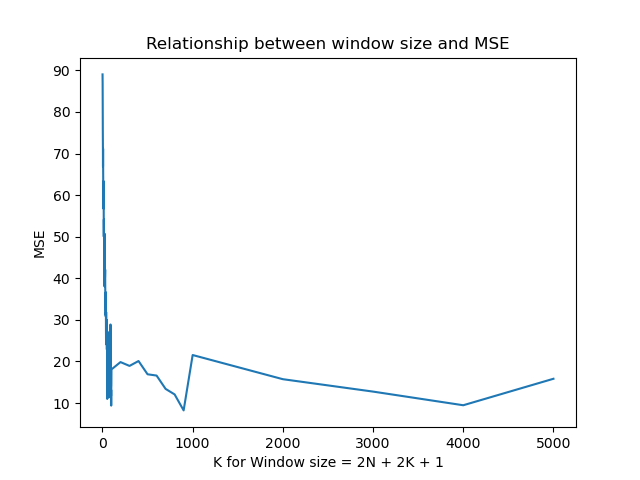
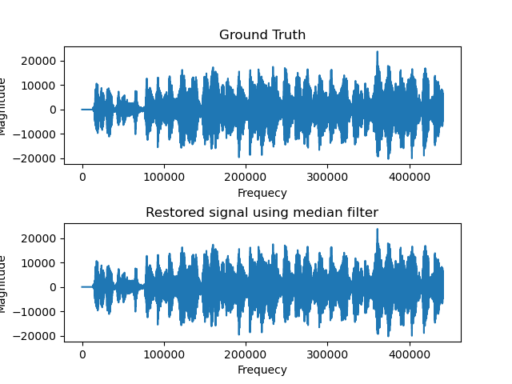

# 5C22 Assignment 2 by Shicheng Dai

## High-level Description of the project
This assignment builds on Assignment I. We assume that we have successfully detected the clicks and we are applying different interpolation methods to restore the audio, such as
- median filtering
- cubic splines

---

## Installation and Execution

ENVIRONMENT(You can install the environment easily by using 'pip install -r requirements.txt'):
```sh
matplotlib==3.6.2
numpy==1.23.5
scipy==1.9.3
tqdm==4.64.1
playsound==1.2.2
```

Afer installing all required packages you can run the demo file simply by typing:
```sh
python main_cubic.py
python main_median.py
```
In order to show the relationship between window size for media filter and the MSE for ouput, youcan use the file by typing:
 ```sh
python MSE_for_median.py
```
---

## Methodology and Results
Two functions have been designed to restore the audio signal by median filter and cubic filter separately. In both main functions, the audio is read first. This requires reading clean.wav, degraded.wav, and the click detection file from Assignment 1, respectively.

My strategy in calculating the window size of the median filter is to first label the locations of the clicks in the signal sequence and detect the number of consecutive clicks at each click location. Each click is assigned a separate window size based on the number of consecutive clicks in order to improve the accuracy of audio processing. After getting the corresponding position and the window size for one. It is also necessary to check the length of the array for calculating the median, to determine whether the length of the data on both sides of the click location meets the requirements for calculating the median, and if not, to add the corresponding length of the zero array at the corresponding location. After setting the array for calculating the median, all the data in the array are arranged in order and the one in the middle position is taken to replace the original data. A new audio signal is generated after the calculation of each click.

Unit test is applied to the median filter. The detection strategy is to use the np.median function to calculate the median and assign a value after building the array used to calculate the median. Finally, the two restored signals are compared. If all the values are equal, then it passes, otherwise it does not pass.

For cubic filter, the strategy is to first label all click positions in the data. The frequency positions and corresponding magnitudes of all non-click positions are used as two new sets of input variables. Using these two sets of variables, a new function is generated by applying the cubic spline function to the fit and calculating the predicted values of all click locations in this function. After the calculation, all the estimated values are brought back to the original data to generate the restored data.

Further research has been conducted on Median filter. The trend of MSE was observed by changing the window size corresponding to the click.


**Results**

1. For the median filter, different lengths were explored to test the effectiveness of the restoration. In particular, window size from 2n + 21 to 2n + 2001 were tested and 2n + 1801 was observed to deliver the lowest MSE, as shown in the figure below.



The restored waveform <restored1.wav> with the optimal filter length is given below:




2. Using the cubic splines, we observe the computing speed is quite slow because there will be more data to be processed comparing with the median filter.

The restored waveform <restored2.wav> with the optimal filter length is given below:


3. Comparing the two different interpolation methods, we notice that the method of median filter achieves a lower MSE. The runtime of median filter method is 13.089s, the one of cubic spline is 7mins 33s.
But after hearing the two audios, though there is a higher MSE for Cubic soline, the performance for it is better then the one processed by median filter.


---
## Credits

This code was developed for purely academic purposes by Shicheng Dai as part of the module 5C22 Compuntational Methods. You can get access to the codes via https://github.com/ShichengDai/5c22-Tasks/tree/main/Assignment2


